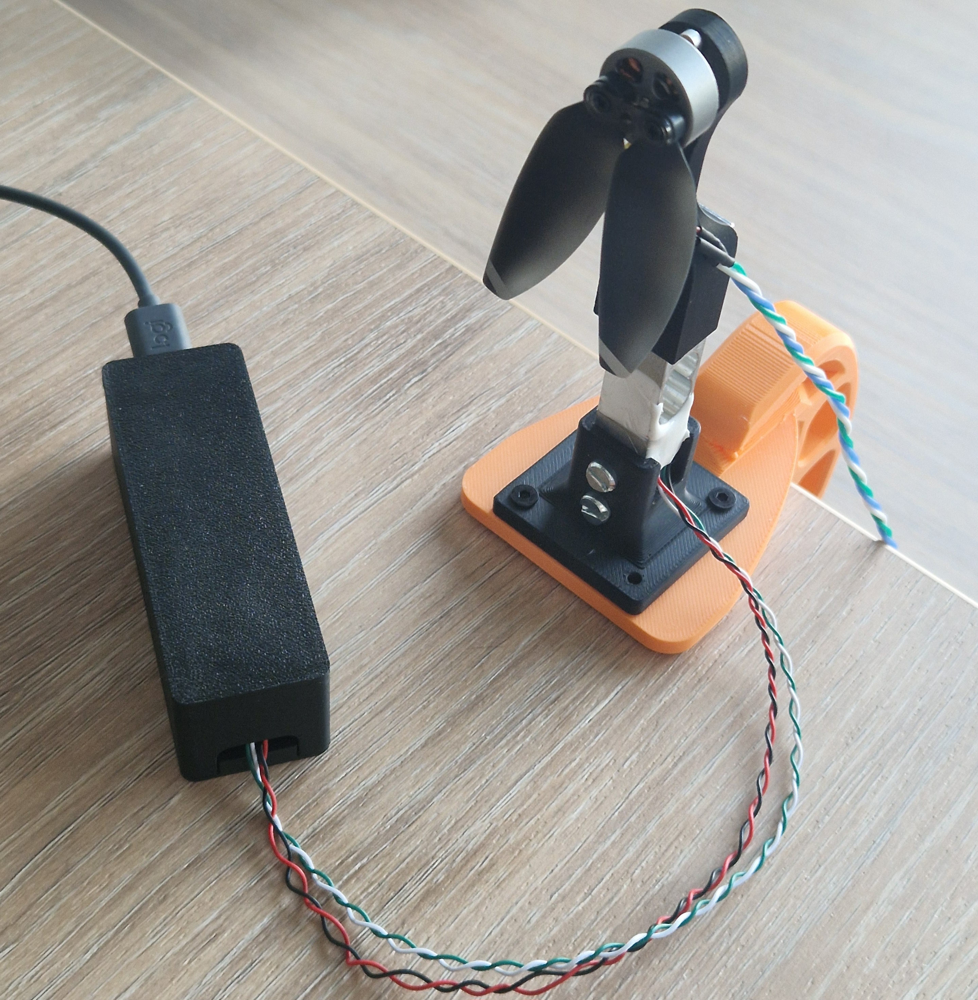

# Propeller Thrust Stand

This project is a very simple open source thrust stand.
It includes:
- Firmware for an mcu that is connected to a load cell
- PC tool to run propeller tests and record the thrust data 
- PC tool to analyze the results. Primarily to find appropriate Ardupilot parameters such as `MOT_THST_EXPO`
- STL files for 3D-printed mount

